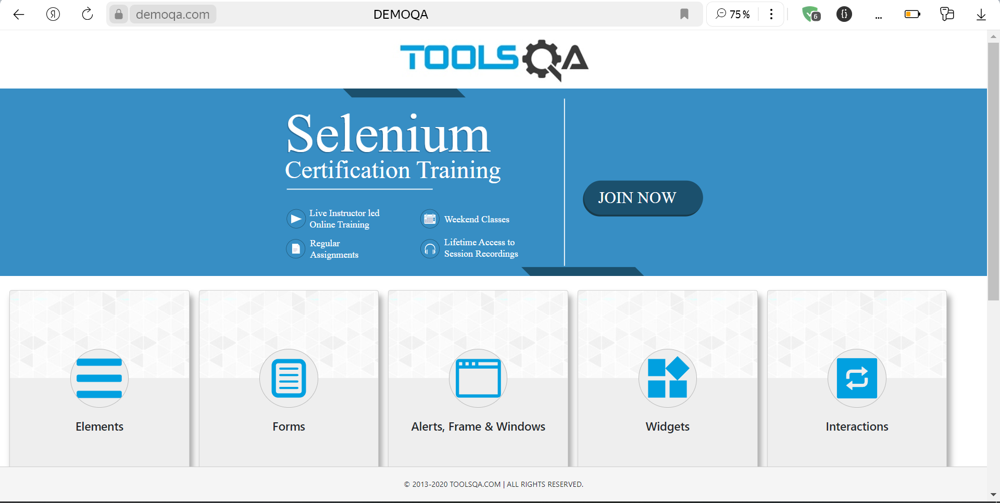

# Проект по автоматизации тестирования API на сайте - demoqa.com.


<a name="оглавление"></a>
# Оглавление
1. [Технологии](#технологии)
2. [Выполненные проверки](#проверки)
3. [Запуск тестов](#запуск_локально)
    1. [Запуск тестов локально](#запуск_локально)
    2. [Запуск отчетов в AllureReport](#формирование_отчетов)
4. [Allure](#Allure)

<a name="технологии"></a>
# Использованны слудующие технологии:
<p align="center">


</p>

[К оглавлению ⬆](#оглавление)
<a name="проверки"></a>
# Выполненные проверки
- Проверка списка книг
- Авторизация с корректными данными
- Авторизация с не существующим username
- Авторизация с некорректным паролем
- Проверка запроса с параметром и проверка Title
- Проверка запроса с параметром и проверка всех параметром Book
- Проверка существования пользователя
- Проверка неавторизованного пользователя

[К оглавлению ⬆](#оглавление)
<a name="запуск_локально"></a>
# Запуск тестов
Локальный запуск осуществляется командой: 
```
maven clean test
```
<a name="формирование_отчетов"></a>
# Формирование отчетов
Формирование AllureReport:
```
maven allure:serve
```

[К оглавлению ⬆](#оглавление)
<a name="Allure"></a>
# Allure и Allure TestOps
Главный экран отчета


Страница с проведенными тестами


Каждый запрос и ответ API логируется в удобном виде с помощью настраиваемых шаблонов


Allure TestOps Главный экран


Allure TestOps страница с тестами


Allure TestOps выполненные прогоны


[К оглавлению ⬆](#оглавление)
