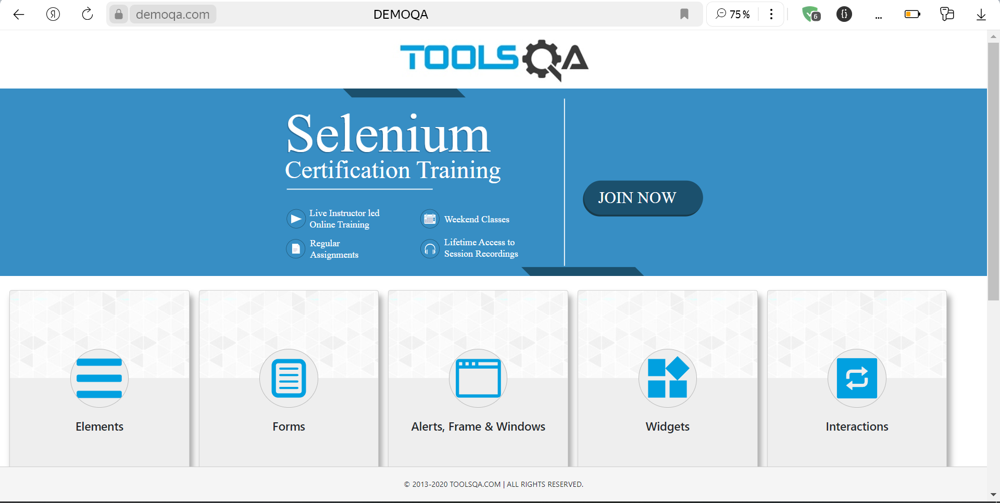
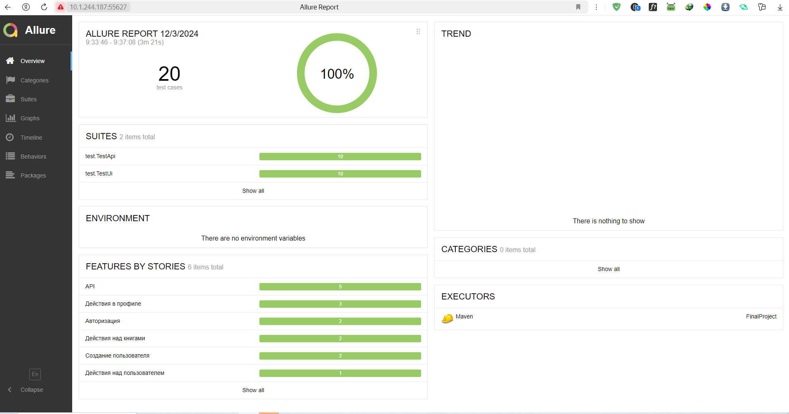
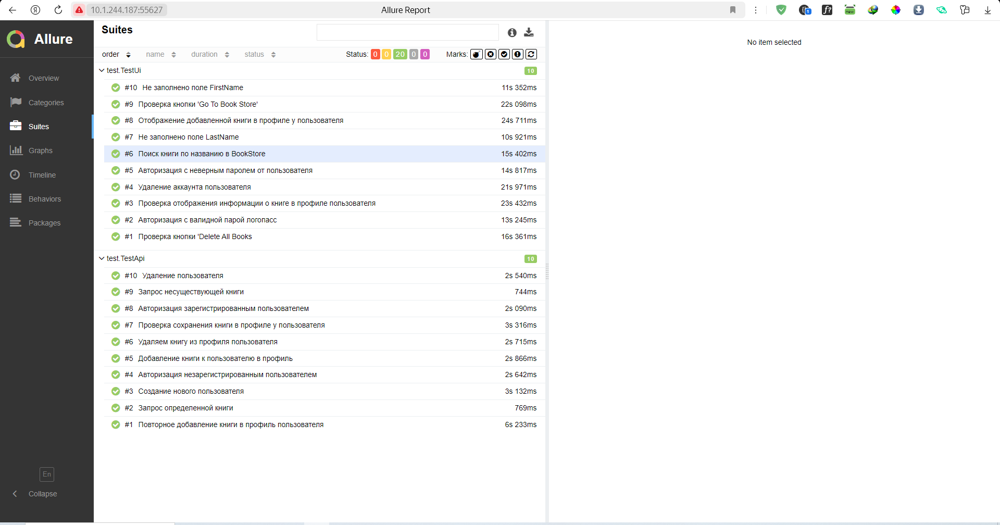
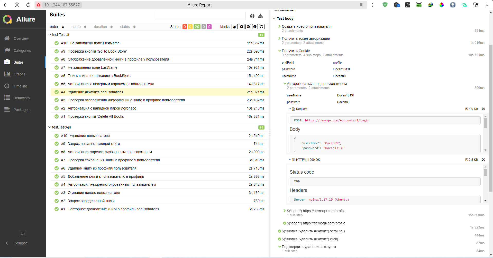
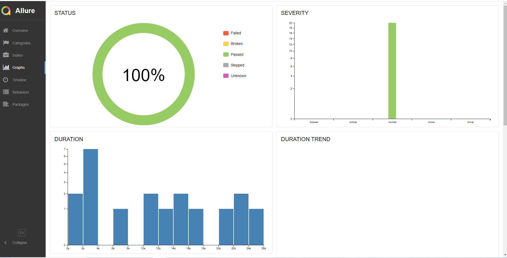
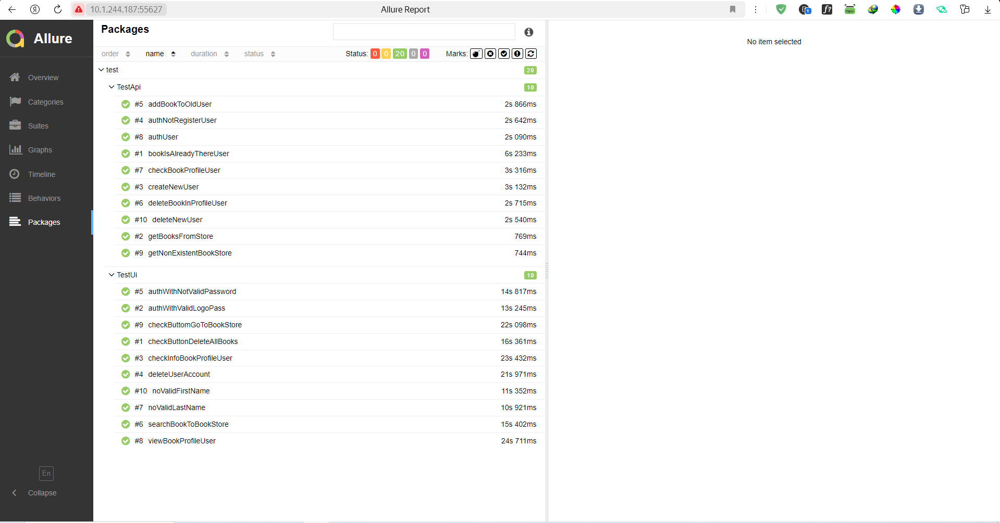
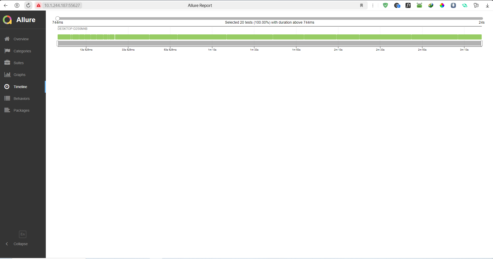

# Проект по автоматизации тестирования API на сайте - demoqa.com.


<a name="оглавление"></a>
# Оглавление
1. [Технологии](#технологии)
2. [Выполненные проверки](#проверки)
3. [Запуск тестов](#запуск_локально)
    1. [Запуск тестов локально](#запуск_локально)
    2. [Запуск отчетов в AllureReport](#формирование_отчетов)
4. [Allure](#Allure)

<a name="технологии"></a>
# Использованны слудующие технологии:
<p align="center">


</p>

[К оглавлению ⬆](#оглавление)
<a name="проверки"></a>
# Выполненные проверки
- Создание нового пользователя
- Авторизация зарегистрированным пользователем
- Авторизация незарегистрированным пользователем
- Добавление книги к пользователю в профиль
- Повторное добавление книги  в профиль пользователя
- Удаляем книгу из профиля пользователя
- Удаление  пользователя
- Запрос определенной книги
- Запрос несуществующей книги
- Проверка сохранения книги в профиле у пользователя
- Авторизация  с неверным паролем от пользователя
- Авторизация с валидной парой логопасс
- Проверка кнопки 'Go To Book Store'
- Не заполнено поле LastName
- Не заполнено поле FirstName
- Удаление аккаунта пользователя"
- Отображение добавленной книги в профиле у пользователя
- Проверка кнопки 'Delete All Books
- Проверка отображения информации о книге в профиле пользователя
- Поиск книги по названию в BookStore

[К оглавлению ⬆](#оглавление)
<a name="запуск_локально"></a>
# Запуск тестов
Локальный запуск осуществляется командой: 
```sh
mvn clean test
```
<a name="формирование_отчетов"></a>
# Формирование отчетов
Формирование AllureReport:
```sh
mvn allure:serve
```
[К оглавлению ⬆](#оглавление)
<a name="Allure"></a>
# Allure и Allure TestOps
Главный экран отчета


Страница с проведенными тестами


Каждый запрос и ответ API логируется в удобном виде с помощью настраиваемых шаблонов


Allure TestOps Главный экран


Allure TestOps страница с тестами


Allure TestOps выполненные прогоны


[К оглавлению ⬆](#оглавление)
